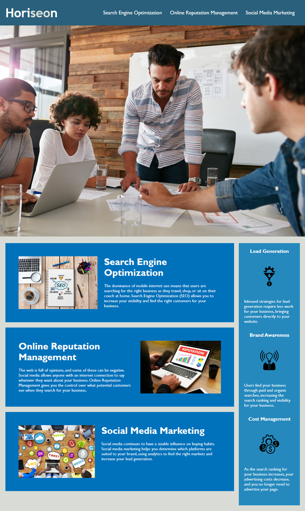

# Horiseon-refactor
## Overview
The reason behind this challenge was to practice and successfully impletent Semantic HTML elements. Code in this project has been rewritten to better understand while accomadting accessibility points. For example, the starter code was given with numerous div elements, for an effecient read those div elements can be replaced with section, header, article and footer elements. Also, all images were missing alt tags. The CSS Style had some repeating code with the same values that would cause possible frustration or confusion for other engineers. I feel confident in my work done but that does not mean it is perfect. Working on this project I learned to be patient and go over code multiple times to catch any mistakes. 

## Usage 

## How to contribute
Kevinserrano0823@gmail.com